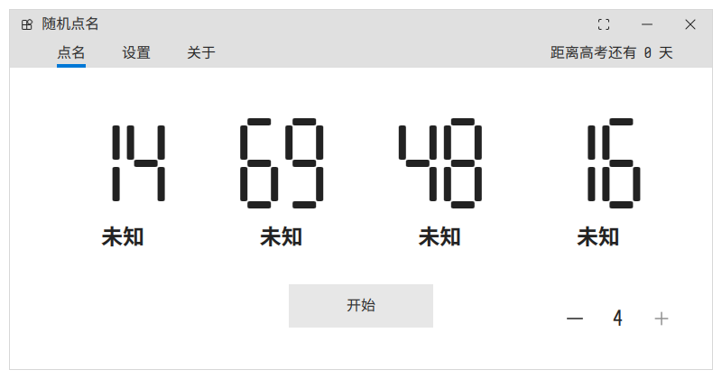
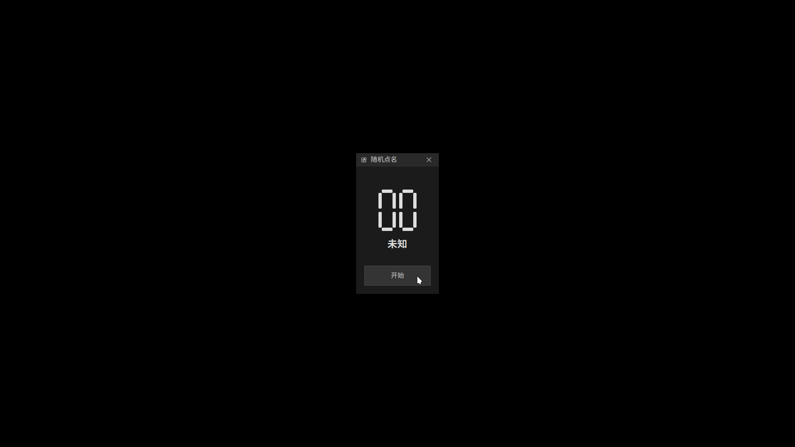

# Roll Call

课堂随机点名小工具。

前身：https://github.com/Reverier-Xu/RandomNames

## 用法

点开即可。

尽量使用了前代 FluentDesign 的设计风格，全部使用 Rx.UI 组件。

移除了不必要的繁杂元素，仅保留了最基本的功能。

针对部分课堂教学机投影仪与黑板反光干扰的问题，增加了防光模式，点击右上角的全屏按钮即可开启。

开启后会进入黑屏状态，仅保留中心的点名程序，方便在黑板上看清粉笔字：

防光模式下，点击右上角的关闭按钮即可回到正常模式。

# 授权

本软件基于 GPL v3 许可证进行授权，您可以在遵守许可证规定的情况下对本软件进行任意修改与再分发。
